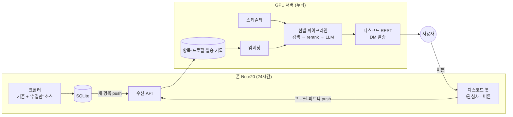

# 개인 맞춤형 AI 에이전트 — 설계 계획

작성: 2026-09-22 · 상태: **계획(미착수)** · [ROADMAP.md §3](ROADMAP.md)의 "온디바이스 대화형 에이전트" 안을 대체한다.

> **한 줄 요약** — 사용자가 적어 둔 관심사·서사를 기억해 두고, 여러 소스에서 모은 공지·대외활동·행사 중
> 그 사람에게 맞는 것만 골라 **사용자가 정한 주기**로 정리해 보낸다. 폰은 수집만, 판단은 GPU 서버가 한다. 후원자 전용.

---

## 0. 왜 필요한가

지금 구조(학과별 채널 + 건마다 요약)는 **소스 하나가 하루 수 건**일 때 잘 동작한다. 링커리어처럼 양이 많은 소스는 이 구조로 감당할 수 없다.

| | 수치 (2026-09 실측) | 문제 |
|---|---|---|
| 링커리어 | 글 번호가 5.4일에 1,313 증가 → **하루 약 240건** | 폰 LLM(슬롯 1개, 건당 ~17초, 부하 시 서버 사망) · UPDATE_LIMIT(10분에 10건) · 디스코드 채널 가독성 셋 다 초과 |
| 코엑스·킨텍스 등 행사 일정 | 팝업·웨딩·베이비페어가 대부분 | 반도체대전 같은 소수만 가치 있음 → **사람마다 다름** |

결론: 대량 소스는 "모두에게 전부"가 아니라 **"각자에게 맞는 몇 건"**으로 보내야 한다. 이건 채널 알림이 아니라 개인화 문제다.

## 1. 목표 / 비목표

**목표**
- 사용자가 자연어로 관심사·상황(학년·전공·진로·기피 분야 등)을 적으면 기억한다.
- 사용자가 정한 주기(예: 매일 08시, 주 2회)에 맞춤 다이제스트를 보낸다. 항목마다 **"왜 당신에게"**를 붙인다.
- 피드백(👍/👎/"이 분야 관심 없음")으로 점점 정확해진다.
- 대량 소스(링커리어·행사 일정·OpenAPI 계열)를 **건당 LLM 비용 없이** 수용한다.

**비목표 (지금은 하지 않음)**
- 대화형 Q&A 챗봇. 기존 ROADMAP §3 안이었으나, 대화형은 지연·동시성 요구가 커서 뒤로 미룬다. 다이제스트가 안정된 뒤 확장.
- 기존 학과 채널 알림 대체. 채널 알림은 비후원자 포함 **전원에게 그대로 유지**한다.

## 2. 사용자 흐름

1. **등록** — `/관심사` → 디스코드 모달에 자유 서술 입력 (예: "IT대 3학년, 백엔드 지망. 공모전보다 인턴·현장실습. 서울/판교. 디자인 쪽은 관심 없음")
2. **주기 설정** — `/다이제스트 주기` (매일/주 N회, 시각)
3. **받기** — DM(또는 개인 비공개 채널, §11 미결정)으로 5~10건. 각 항목: 제목·출처·마감일·한 줄 이유·원문 링크
4. **피드백** — 항목별 버튼. 프로필 가중치와 평가 데이터에 반영
5. **관리** — `/관심사 보기·수정`, `/다이제스트 지금`(쿼터 내), `/내정보삭제`

## 3. 아키텍처

원칙(ROADMAP 결론 계승): **폰은 인바운드를 받지 않는다.** 폰 → 서버 방향으로만 연결한다.

| | 폰 | GPU 서버 |
|---|---|---|
| 역할 | 수집·저장, 디스코드 게이트웨이(봇 1개) | 임베딩·선별·생성·발송·스케줄 |
| 연결 | 서버로 **아웃바운드 push**만 | push 수신 전용 엔드포인트 |
| 발송 | — | 봇 토큰으로 디스코드 REST 직접 호출 (지금 `notifier`와 같은 방식, 게이트웨이 연결 불필요) |
| 가용성 | 상시 | 개발용 PC는 상시가 아닐 수 있음 → 폰은 push를 쌓아뒀다 재전송, 서버는 밀린 다이제스트를 따라잡음 |

### 3-1. "수집만" 모드 (폰 쪽, 에이전트 이전에 먼저 필요)

대량 소스는 지금 파이프라인(채널 발송 + 건마다 요약)을 타면 안 된다. `depts`에 발송·요약을 끄는 설정을 두어 **수집·저장만** 하게 한다. `fetch_config` 옵션 또는 열 하나로 표현 — 사이트별 분기가 아니라 범용 옵션.

## 4. 데이터 모델 (서버)

| 테이블 | 핵심 필드 | 비고 |
|---|---|---|
| `items` | 출처, URL(고유), 제목, 본문 텍스트, **마감일**, 시작일, 대상(학년·학과), 분류, 등록일, 임베딩 | ROADMAP "공통 선결 과제 — 데이터 계약"과 같은 일. 기존 `notices`와 필드를 맞춘다 |
| `profiles` | 사용자ID, 원문 서술(버전별), 구조화 필드(학년·전공·관심·기피·선호 형태·지역), 임베딩, 수정일 | 원문 보존 — 구조화는 언제든 다시 할 수 있게 |
| `schedules` | 사용자ID, 주기, 시각, 마지막 발송 시각 | 시스템 cron을 사용자마다 만들지 않는다 |
| `deliveries` | 사용자ID, 항목ID, 발송 시각, 순위, 이유 | 중복 발송 방지 + 평가 |
| `feedback` | 사용자ID, 항목ID, 종류(👍/👎/분야 제외), 시각 | 프로필 가중치 + 평가 라벨 |

**마감일은 소스의 구조화 필드에서만 가져온다. LLM이 생성하지 않는다.** (ROADMAP이 "마감일 오답은 고위험"으로 지적한 부분) 링커리어는 상세 페이지 `__NEXT_DATA__`, 진로취업센터는 "모집기간" 칸, 자소설닷컴은 API의 `end_time`에 있다. 구조화 필드가 없는 소스는 정규식으로 추출하고, 실패하면 "마감일 미상"으로 표시한다.

## 5. 선별 파이프라인

여기서 RAG는 방향이 뒤집혀 있다: **질의 = 사용자 프로필, 검색 대상 = 최근 항목.**

| 단계 | 방법 | 규모 |
|---|---|---|
| ① 후보 | 지난 발송 이후 새 항목 ∪ 아직 안 보낸 항목, **마감 지남 제외** | 수백~수천 |
| ② 하드 필터 | 학년·학과·재학 상태, "분야 제외" 피드백 | ↓ |
| ③ 1차 검색 | 프로필 임베딩 ↔ 항목 임베딩(dense) + 키워드(BM25) 혼합 | 상위 ~100 |
| ④ rerank | cross-encoder reranker | 상위 ~25 |
| ⑤ 생성 | LLM이 25건을 읽고 5~10건 선택·정렬, 항목별 "왜 당신에게" 한 줄 | 출력 |

- 후보가 최근 며칠치 수천 건 규모라 **벡터 DB가 필요 없다.** SQLite + numpy 코사인 유사도로 충분 (필요해지면 sqlite-vec). 프로젝트의 무외부의존 원칙 유지.
- 임베딩은 항목이 들어올 때 **한 번만** 계산해 저장. LLM은 ⑤에서만 쓴다 → **대량 소스의 건당 LLM 비용 0.**
- ⑤의 출력은 항목 ID만 고르게 하고, 제목·마감일·링크는 **DB 값으로 채운다** (LLM이 사실 필드를 다시 쓰지 않게).

## 6. 모델·하드웨어

> 아래 모델·NPU 관련 내용은 작성 시점 지식 기준이며 **도입 전 확인 필요**.

| 단계 | 하드웨어 | 후보 |
|---|---|---|
| 개발 | 개인 GPU (VRAM 64GB) | 생성: 한국어가 강한 30B급 — EXAONE 4.0 32B, Qwen3-32B / Qwen3-30B-A3B(MoE, 빠름), Gemma 3 27B 임베딩: bge-m3 (다국어·한국어) · reranker: bge-reranker-v2-m3 서빙: vLLM (OpenAI 호환) |
| 운영 | 퓨리오사 RNGD (협조 요청 검토) | LG AI연구원이 EXAONE 추론에 RNGD를 채택한 것으로 알고 있음 → **EXAONE 계열로 개발하면 개발→운영 이전이 가장 자연스러움**. 서빙은 furiosa-llm (OpenAI 호환) |

- 모든 모델을 **OpenAI 호환 엔드포인트** 뒤에 둔다. GPU → 퓨리오사 전환이 지금의 `LLM_BASE_URL`처럼 설정 변경으로 끝나게.
- 퓨리오사 협조 요청 때 확인할 것: 지원 모델 목록, 컨텍스트 길이, 임베딩·reranker 모델 구동 가능 여부. 안 되면 임베딩·rerank는 CPU로도 감당 가능 (항목 수가 적음).
- 현재 폰 E2B는 이 작업에 쓰지 않는다 (컨텍스트·처리량·지능 모두 부족, 이미 부하로 서버가 죽는 중).

## 7. 비용 추정 (대략)

| 항목 | 가정 | 값 |
|---|---|---|
| 다이제스트 1건 | 프로필 ~500 + 후보 25건 × ~250 토큰 | 입력 ~7천 · 출력 ~1천 토큰 |
| 후원자 100명 × 매일 | | 입력 ~70만 · 출력 ~10만 토큰/일 |
| GPU 시간 | 30B급 + vLLM 배치 | **하루 1시간 안쪽** (추정) |
| 임베딩 | 항목 수백~천 건/일 | 무시할 수준 |

→ 이 서비스의 비용은 **건당 연산이 아니라 "항상 켜진 GPU"라는 고정비**다. 후원 모델은 사용자 수보다 **가용성·하드웨어 비용**을 기준으로 설계해야 한다. 사용자가 늘어도 한계비용은 작다.

## 8. 후원자 게이팅·쿼터

- 디스코드 **"후원자" 역할**로 에이전트 명령을 게이팅. 역할 부여 방식(디스코드 서버 구독 / 외부 후원 플랫폼 연동 / 수동)은 §11.
- 쿼터: 정기 발송 주기 하한(예: 하루 1회), `/다이제스트 지금` 일일 횟수, 다이제스트당 건수 상한.
- 비후원자: 기존 채널 알림 그대로. 에이전트 명령엔 안내 메시지.

## 9. 개인정보·안전

- 관심사 서술은 개인정보다. 등록 시 **명시적 동의**, `/내정보삭제`로 프로필·발송·피드백 전부 삭제.
- **로그 원칙의 예외**: 이 프로젝트는 "로그에 거의 모든 것을 남긴다"가 원칙이지만, **프로필 원문은 로그에 남기지 않는다** — 사용자 ID·글자 수·버전만. 선별 로그에는 항목 ID·점수·순위를 남긴다 (디버깅에 충분).
- 다이제스트에 기존 면책 문구 + 원문 링크 필수.
- 폰 → 서버 push는 HTTPS + 공유 비밀키 인증.

## 10. 평가

"관심있을 만한 것"의 품질이 곧 제품이므로 출시 전에 측정한다.

- **오프라인**: 페르소나 5~10개(본인·지인·가상) × 최근 항목 → 사람이 관련/무관 라벨 → 상위 10건 정밀도, 놓친 중요 항목(재현율 근사).
- **온라인**: 👍 비율, "관심 없음" 비율, 링크 클릭(가능하면), 구독 유지율.
- 단계 ③④⑤ 각각을 끄고 켜며 비교 (임베딩만 / +rerank / +LLM).

## 11. 미결정 사항

| 항목 | 선택지 |
|---|---|
| 발송 경로 | DM / 사용자별 비공개 채널 (DM은 사용자가 막을 수 있음) |
| 후원 연동 | 디스코드 서버 구독 / 외부 플랫폼(토스·Patreon 등) + 수동 역할 부여 |
| 주기 범위 | 최소 간격, 요일·시각 자유도 |
| 프로필 저장 위치 | 서버 단일 원본 (권장) / 폰 + 서버 동기화 |
| 서버 상시성 | 개발 PC를 운영에 쓸지, 퓨리오사 전까지 클라우드 GPU를 쓸지 |

## 12. 단계별 계획

| 단계 | 내용 | 필요 자원 | 완료 기준 |
|---|---|---|---|
| **1. 수집 기반** | "수집만" 모드, 공통 항목 스키마, 대량 소스(링커리어·코엑스·자소설닷컴 API 등) 적재 시작 | 폰만 (GPU 불필요) | 2주치 항목이 스키마대로 쌓임, 마감일 추출률 측정 |
| **2. 오프라인 파이프라인** | 서버 수신·임베딩·선별·생성을 배치로. 페르소나 다이제스트 생성 + 라벨링 | 개발 GPU | 페르소나별 상위 10 정밀도 목표치 달성 (목표치는 1차 측정 후 설정) |
| **3. 디스코드 연결 + 베타** | `/관심사`·주기·버튼·삭제, 후원자 게이팅, 소수 베타 | 개발 GPU | 베타 사용자 2주 운영, 피드백 루프 동작 |
| **4. 운영 이전** | 퓨리오사(또는 대안)로 이전, 가용성·모니터링 | NPU/서버 | 엔드포인트 교체만으로 동작, 상시 운영 |

1단계는 에이전트 여부와 무관하게 쓸모가 있다 (데이터가 먼저 쌓여 있어야 2단계 평가가 가능). 지금 바로 시작할 수 있는 유일한 단계이기도 하다.
